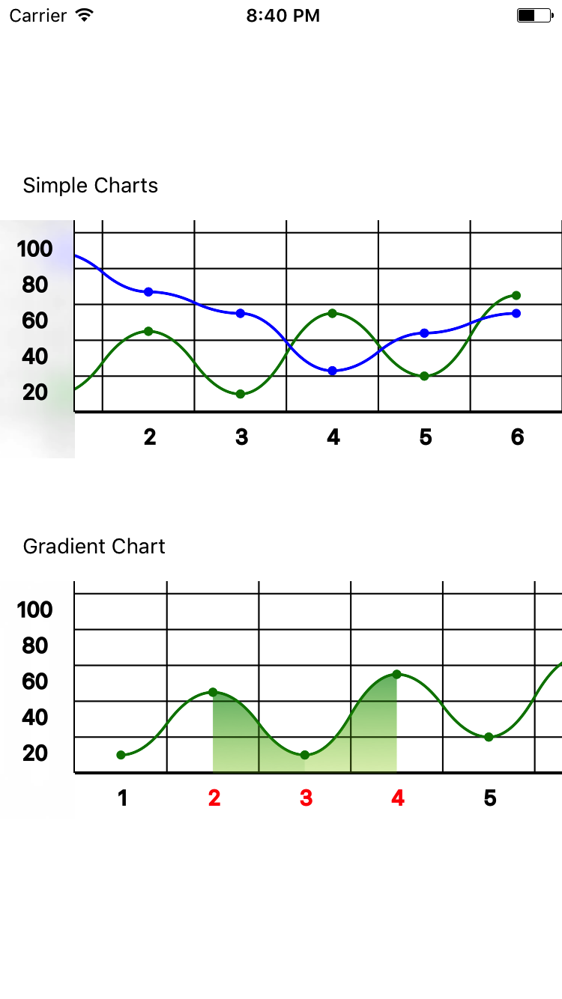

# ReactNativeSimpleCharts
[](https://npmjs.org/package/react-native-simple-charts "View this project on npm")
[](https://npmjs.org/package/react-native-simple-charts "View this project on npm")

### Simple charts with gradient for react-native.
- Allow to use multiple charts.
- Use chart with gradient filling.
- Customize charts: axis, height, steps OY and more other things.
- Chart automatically scale OY axis data and round OY values to usual perception.

## Installation
Just paste in terminal `npm install react-native-simple-charts --save && react-native link react-native-simple-charts && react-native link react-native-svg && react-native link react-native-blur`



# Usage

## Simple Charts

```js

import Chart from 'react-native-simple-charts'
...

  render() {
    let greenChartProps = {
      "strokeWidth": 2,
      "renderPoints": true,
      "strokeColor": 'green',
      "pointColor1": 'green',
      "pointColor2": 'green',
    }
    let blueChartProps = {
      "strokeWidth": 2,
      "renderPoints": true,
      "strokeColor": 'blue',
      "pointColor1": 'blue',
      "pointColor2": 'blue',
    }
    let data = [
      {
        "chart": [
          {
            "x": '1',
            "y": 10,
            "props": greenChartProps
          },
          {
            "x": '2',
            "y": 45,
            "props": greenChartProps
          },
          {
            "x": '3',
            "y": 10,
            "props": greenChartProps
          },
          {
            "x": '4',
            "y": 55,
            "props": greenChartProps
          },
          {
            "x": '5',
            "y": 20,
            "props": greenChartProps
          },
          {
            "x": '6',
            "y": 65,
            "props": greenChartProps
          },
        ],
      },
      {
        "chart": [
          {
            "x": '1',
            "y": 89,
            "props": blueChartProps
          },
          {
            "x": '2',
            "y": 67,
            "props": blueChartProps
          },
          {
            "x": '3',
            "y": 55,
            "props": blueChartProps
          },
          {
            "x": '4',
            "y": 23,
            "props": blueChartProps
          },
          {
            "x": '5',
            "y": 44,
            "props": blueChartProps
          },
          {
            "x": '6',
            "y": 55,
            "props": blueChartProps
          },
        ],
      }
    ]

    return (
      <Chart
          data={data}
          stepsOY={5}
      />
    );
  }
```

## Gradient Chart
### Note if you want to use chart with gradient filling it should be only one.

```js

import Chart from 'react-native-simple-charts'
...

  render() {
    let greenChartProps = {
      "strokeWidth": 2,
      "renderPoints": true,
      "strokeColor": 'green',
      "pointColor1": 'green',
      "pointColor2": 'green',
    }
    let data = [
      {
        "chart": [
          {
            "x": '1',
            "y": 10,
            "props": greenChartProps
          },
          {
            "x": '2',
            "y": 45,
            "props": {
              ...greenChartProps,
              fillGradient: true,
              gradientEndColor: 'green',
              gradientStartColor: 'yellow'
            }
          },
          {
            "x": '3',
            "y": 10,
            "props": {
              ...greenChartProps,
              fillGradient: true,
              gradientEndColor: 'green',
              gradientStartColor: 'yellow'
            }
          },
          {
            "x": '4',
            "y": 55,
            "props": greenChartProps
          },
          {
            "x": '5',
            "y": 20,
            "props": greenChartProps
          },
          {
            "x": '6',
            "y": 65,
            "props": greenChartProps
          },
        ],
      }
    ]

    return (
      <Chart
          data={data}
          stepsOY={5}
          axisTextColorActive={'red'}
          activeAxisXTextArray={['2', '3', '4']}
      />
    );
  }
```

## Props

```js

    data: React.PropTypes.array.isRequired,
    height: React.PropTypes.number,
    width: React.PropTypes.number,
    backgroundColor: React.PropTypes.any,
    gradientOpacityStart: React.PropTypes.string,
    gradientOpacityEnd: React.PropTypes.string,
    axisTextColor: React.PropTypes.any,
    axisTextOpacity: React.PropTypes.number,
    activeAxisXTextArray: React.PropTypes.array, // you can set unique text color for special OX axis values
    axisTextColorActive: React.PropTypes.any, //there is this color
    hideXAxe: React.PropTypes.bool,
    hideYAxe: React.PropTypes.bool,
    axisStrokeWidth: React.PropTypes.number,
    axisColor: React.PropTypes.any,
    axisOpacity: React.PropTypes.number,
    pointRadius: React.PropTypes.number, // chart point radius
    axisLinesColor: React.PropTypes.string, // horizontal and vertical chart lines
    axisLinesOpacity: React.PropTypes.number,
    axisLinesWidth: React.PropTypes.number,
    renderAxisXSectors: React.PropTypes.bool,
    axisXSectorsColor: React.PropTypes.string,
    axisXSectorsOpacity: React.PropTypes.number,
    renderAxisXLines: React.PropTypes.bool, // vertical lines
    renderAxisYLines: React.PropTypes.bool, //horizontal lines
    leftPanelBG: React.PropTypes.any, // OY axis text backgroundColor
    renderBlur: React.PropTypes.bool, // IOS only blured OY axis text
    blurProps: React.PropTypes.any,
    leftPanelWidth: React.PropTypes.number,
    stepsOY: React.PropTypes.number, // number of section on axis Y
    scaleXAxis: React.PropTypes.number, // define chart condensation
    maxYValue: React.PropTypes.number // set max OY value that can be rendered

## Default Props

    height: 150,
    backgroundColor: 'white',
    stepsOY: 4,
    axisTextColor: 'black',
    axisTextOpacity: 1,
    axisColor: 'black',
    axisOpacity: 1,
    axisLinesOpacity: 1,
    axisLinesWidth: 1,
    axisStrokeWidth: 2,
    axisLinesColor: 'black',
    scaleXAxis: 5.5,
    renderAxisXLines: true,
    renderAxisYLines: true,
    leftPanelWidth: 50,
    leftPanelBG: 'white',
    renderBlur: true,
    gradientOpacityStart: '0.0',
    gradientOpacityEnd: '0.55'

```

### data

An array of points. This should be provided with an __array of objects__.

```js
[
      {
        "chart": [
          {
            "x": '1',
            "y": 10,
            "props": {
              "strokeWidth": 2, // chart stroke width
              "strokeColor": 'green',
              "renderPoints": true,
              "pointColor1": 'green', // this define 1:10 point color
              "pointColor2": 'green', // this define 2:Y point color (next point)
              "fillGradient": false, // if you set true then gradient will fill area from 1 to 2 OX value
              "gradientStartColor": 'green',
              "gradientEndColor": 'green',
            }
          },
          ...
        ]
      },
  ...
]

```

## Questions or suggestions?

Feel free to [open an issue](https://github.com/ArtemKosiakevych/ReactNativeSimpleCharts/issues)
